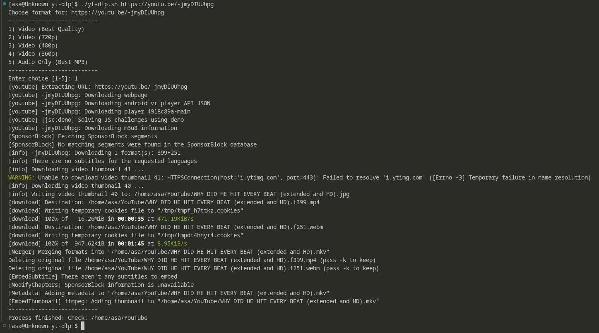

# yt-dlp.sh

A thin, opinionated Bash wrapper around [`yt-dlp`](https://github.com/yt-dlp/yt-dlp) that turns "download this YouTube link" into a 5-option menu and gets out of your way. Auto-organizes into playlist folders, rips with `aria2c` at 16 connections, strips sponsor segments, and embeds metadata + thumbnails + subtitles — all before you've finished your coffee.

No config files. No flags to memorize. Just run it, paste a URL, pick a number.

---

## Features

- **Interactive format menu** — best quality, 720p, 480p, 360p, or audio-only MP3
- **Automatic playlist detection** — asks `yt-dlp` for the playlist title first (via a fast `--flat-playlist` probe) and creates a subfolder for it; single videos go straight into `~/YouTube`
- **`aria2c`-accelerated downloads** — 16 connections, 16 splits, 1M chunk size, because waiting is for people without multi-threaded downloaders
- **SponsorBlock integration** — automatically strips sponsor segments from video downloads
- **Metadata + thumbnail embedding** — every file comes out tagged and thumbnailed, ready for your media library
- **Auto-subtitles** — embeds English and Arabic auto-generated subs (`en.*`, `ar.*`) into video downloads
- **Download archive** — keeps `archive.txt` in your YouTube folder so re-running the script never re-downloads something you already have
- **Resilient to errors** — `--ignore-errors` means one broken video in a playlist won't kill the whole batch
- **Browser-spoofing User-Agent** — sends a real Chrome/Windows UA string to keep YouTube from getting suspicious
- **MKV output for video** — universally compatible container that plays nice with embedded subs and metadata

---

## Requirements

| Tool | Purpose |
|---|---|
| [`yt-dlp`](https://github.com/yt-dlp/yt-dlp) | The actual downloader (this script is just its butler) |
| [`aria2c`](https://aria2.github.io/) | Multi-connection download backend |
| `bash` | You're already running it |
| `ffmpeg` | Required by `yt-dlp` for merging, embedding, and audio extraction |

Install on Arch:
```bash
sudo pacman -S yt-dlp aria2 ffmpeg
```

Install on Debian/Ubuntu:
```bash
sudo apt install yt-dlp aria2 ffmpeg
```

On Termux:
```bash
pkg install yt-dlp aria2 ffmpeg
```

---

## Installation

```bash
git clone https://github.com/HassanIQ777/yt-dlp
cd yt-dlp
chmod +x yt-dlp.sh
```

Optionally drop it somewhere on your `PATH`:
```bash
sudo cp yt-dlp.sh /usr/local/bin/ytd
```

---

## Usage

```bash
./yt-dlp.sh "<URL>"
```

You'll be prompted:

```
Choose format for: <URL>
---------------------------
1) Video (Best Quality)
2) Video (720p)
3) Video (480p)
4) Video (360p)
5) Audio Only (Best MP3)
---------------------------
Enter choice [1-5]:
```

Anything that isn't `1`–`4` falls through to the audio branch — so technically pressing `5`, `q`, or your cat walking across the keyboard all get you an MP3. This is either a bug or a feature depending on how you feel about cats.

### Examples

```bash
# Single video, interactive menu
./yt-dlp.sh "https://youtube.com/watch?v=dQw4w9WgXcQ"

# Entire playlist — auto-creates a subfolder named after the playlist
./yt-dlp.sh "https://youtube.com/playlist?list=PLxxxxxxxx"
```

Example of the program running:



---

## Output Layout

```
~/YouTube/
├── archive.txt                     # tracks what's already downloaded
├── Some Random Single Video.mkv    # no playlist → goes straight here
└── My Cool Playlist/               # playlist → gets its own folder
    ├── Track 01.mp3
    ├── Track 02.mp3
    └── ...
```

The playlist folder name comes straight from YouTube's own playlist title via `yt-dlp --flat-playlist --print playlist_title`. If that probe returns nothing, `"NA"`, or `"None"` (yt-dlp's literal way of saying "this isn't a playlist"), the script quietly skips the subfolder and downloads flat into `~/YouTube`.

---

## How It Works

1. Creates `~/YouTube` if it doesn't exist.
2. Silently asks `yt-dlp` whether the URL is part of a playlist, and if so, what it's called.
3. Builds the output path accordingly.
4. Assembles a shared array of flags (`COMMON_FLAGS`) used by every download mode — archive tracking, metadata, thumbnails, SponsorBlock, error tolerance, and the `aria2c` backend.
5. Branches on your menu choice via a `case` statement, layering on video-specific flags (`VIDEO_FLAGS`: MKV merge, subtitle embedding) only when relevant.
6. Hands the final command off to `yt-dlp` and reports back when done.

---

## Notes

- Subtitles are pulled via `--write-auto-subs`, meaning they're YouTube's auto-generated captions, not manually authored ones. Accuracy varies (sometimes wildly, sometimes hilariously).
- `--sleep-subtitles 2` adds a small delay before subtitle requests to keep YouTube from getting twitchy about rate limits.
- The script assumes `aria2c` is installed and available on `PATH`; if it's missing, `yt-dlp` will fail loudly rather than silently falling back.

---

## License

See [LICENSE](LICENSE) in this repository.

---

*Made by [HassanIQ777](https://github.com/HassanIQ777)*